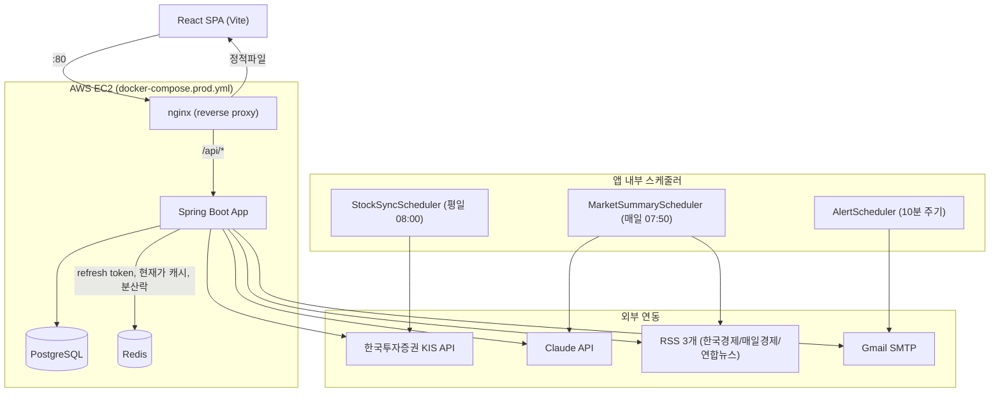

# moaju

한국투자증권(KIS) Open API를 연동한 주식 포트폴리오 관리 서비스.

## 기술 스택

**Backend**: Java 21, Spring Boot 4.1, Spring Security, Spring Data JPA, PostgreSQL, Redis, Redisson
**Frontend**: React 19, Vite, react-router-dom
**Infra**: AWS EC2, Docker Compose, nginx, GitHub Actions

## 아키텍처



## 주요 기능

- **인증**: JWT access/refresh 분리, refresh token은 Redis에 TTL로 저장해 별도 만료 처리 없이 자동 정리
- **증권사 계좌 / 거래 관리**: 계좌별 매수·매도 기록 CRUD
- **포트폴리오 조회**: 보유 수량, 평균 매수가(총평균법), 실현손익/평가손익 분리 계산, 전량 매도한 종목의 실현손익도 총 손익에 반영
- **현재가 조회 + Cache Stampede 방어**: Redis 캐싱(TTL 30초) + Redisson 분산 락으로, 캐시 만료 순간 몰리는 동시 요청이 외부 API(KIS)로 전부 새어나가는 것을 방지
- **목표 수익률 알람**: 계좌별 목표 수익률 설정 시 10분 주기 스케줄러가 확인해 근접/달성 시 이메일 발송
- **AI 시장 요약**: RSS 뉴스 3개를 매일 수집해 Claude API로 요약, 원문 링크/제목은 인덱스 매칭으로 참조해 LLM 환각(hallucination) 방지, 비로그인 사용자도 조회 가능

## Cache Stampede 방어 — 실측 결과

`GET /api/stocks/{ticker}/price`에서 캐시 만료 직후 동시 요청 20건(`ab -n 20 -c 20`)을 발생시켰을 때:

| | 락 적용 전 | 락 적용 후 |
|---|---|---|
| 캐시 히트율 | 90.5% | **95%** |
| 실제 외부 API 호출 | 2건 | **1건** |

서로 다른 종목으로 2회 반복 측정, 동일하게 재현됨(2026-07-06).

## 로컬 실행

```bash
docker compose up -d          # PostgreSQL, Redis, (선택) Prometheus/Grafana
cp .env.example .env           # 값 채워넣기
./gradlew bootRun

cd frontend
npm install
npm run dev                    # http://localhost:3000
```

`.env`에 필요한 값은 `.env.example` 참고. KIS API는 실전투자 서버 특성상 주말/야간엔 연결이 안 될 수 있음(평일 장중 권장).

## CI/CD

GitHub Actions에서 push/PR 시 테스트를 먼저 실행하고(`test` job), 테스트를 통과한 경우에만 main 브랜치 push에 한해 EC2로 배포(`deploy` job, `needs: test`)하도록 구성.

## 테스트

```bash
./gradlew test
```

핵심 도메인 로직(계좌, 거래, 포트폴리오, 회원) 36개 단위 테스트(Mockito 기반).
